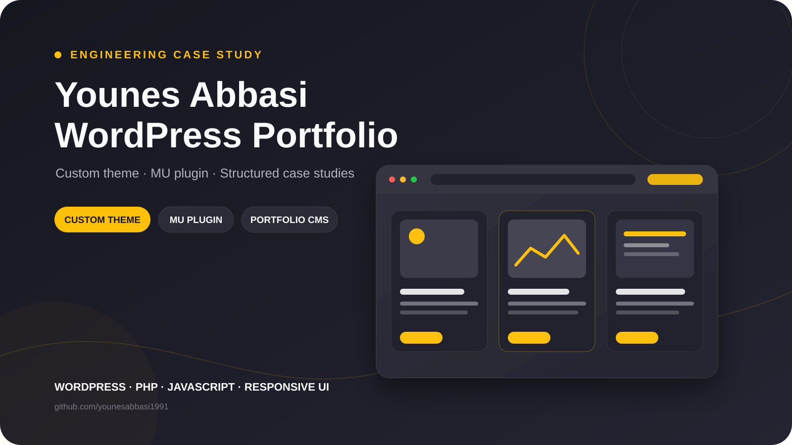
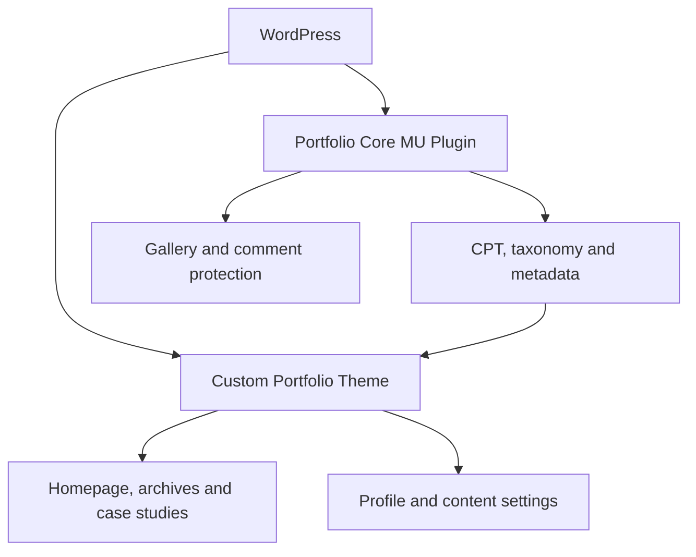

# Younes Abbasi Portfolio — Custom WordPress Case Study

[نسخه فارسی](README.fa.md)

> Public engineering case study for my personal WordPress portfolio. The production theme and MU plugin repositories remain private; this repository contains architecture notes, implementation decisions, and selected generalized code samples.

## Project overview

[Younes Abbasi Portfolio](https://younesabbasi.com/) is my personal platform for presenting WordPress, web development, and SEO work through structured portfolio projects and long-form case studies.

The site uses a custom WordPress implementation with a clear boundary between the content model and the presentation layer. Portfolio data, metadata, gallery behavior, and security controls live in a must-use plugin, while the theme handles the responsive interface, archives, case-study pages, and reusable homepage sections.

| Area | Details |
|---|---|
| Project type | Personal portfolio, case-study system, and publishing website |
| Role | UX/UI adaptation, WordPress architecture, theme engineering, data modeling, responsive frontend, and security |
| Primary language | English, LTR |
| Production source | Private theme and MU plugin repositories |
| Public repository | Documentation and selected generalized code samples |
| Live website | [younesabbasi.com](https://younesabbasi.com/) |
| Status | Active and continuously improved |

## Key outcomes

- Built a dedicated Portfolio custom post type with a hierarchical project taxonomy.
- Kept domain content in an MU plugin so portfolio data survives theme changes.
- Created structured project details for client, dates, status, location, and external project links.
- Added a sortable media-library gallery with per-image horizontal or vertical layouts.
- Built responsive portfolio archives, taxonomy pages, cards, and full case-study templates.
- Added manually ordered featured projects to the homepage without hard-coding project markup.
- Centralized image fallbacks, responsive thumbnail attributes, metadata formatting, and category helpers.
- Implemented layered comment protection using nonce validation, a honeypot, timing checks, link limits, and rate limiting.
- Created reusable settings screens for profile, services, skills, history, recommendations, social links, and contact information.
- Kept frontend dependencies local and loaded assets conditionally where practical.

## High-level architecture

The MU plugin owns durable portfolio data and validation. The theme consumes that data through focused helper classes and renders the public experience. This separation makes the content portable and keeps presentation changes from affecting the underlying project records.

## Core experience areas

### Structured portfolio publishing

Each project can include a title, excerpt, long-form case study, featured image, categories, delivery dates, client information, project status, location, external URL, and an ordered image gallery.

### Responsive project discovery

The portfolio archive combines taxonomy filters, responsive cards, image-orientation classes, pagination, and accessible project links. Featured homepage projects preserve a deliberate editorial order through `post__in` and `orderby => post__in`.

### Long-form case studies

Single project pages combine a cover, description, project facts, external project link, media gallery, and discussion area. Reusable helpers keep output escaping, image fallbacks, dates, and metadata consistent.

### Custom administration

Settings API pages manage profile information, languages, skills, knowledge, services, social profiles, recommendations, work history, and contact settings. Repeatable fields are sortable and sanitized before storage.

### Practical security

Administrative saves use nonces, capability checks, autosave guards, allowlists, and field-specific sanitization. The public comment form uses layered anti-spam controls without requiring a CAPTCHA.

## Representative code

| Sample | What it demonstrates |
|---|---|
| [Portfolio post type](code-samples/portfolio-content-model/PortfolioPostType.php) | REST-enabled portfolio content model and rewrite rules |
| [Portfolio taxonomy](code-samples/portfolio-content-model/PortfolioCategoryTaxonomy.php) | Hierarchical project classification |
| [Featured projects query](code-samples/featured-projects/featured-projects.php) | Validated project IDs, manual ordering, lazy images, and accessible markup |
| [Gallery meta box](code-samples/portfolio-gallery/PortfolioGalleryMetaBox.php) | Media-library selection, layout metadata, validation, and safe persistence |
| [Comment anti-spam](code-samples/comment-antispam/CommentAntispam.php) | Honeypot, signed timing, URL limits, and rate limiting |
| [Portfolio view model](code-samples/portfolio-frontend/PortfolioViewModel.php) | Centralized metadata and responsive gallery preparation |

See [code-samples/README.md](code-samples/README.md) for the scope and limitations of these extracts.

## Technology

- PHP and WordPress APIs
- Custom post types, taxonomies, post meta, and the Settings API
- HTML5, CSS3, Bootstrap grid utilities, JavaScript, and jQuery
- Isotope, Swiper, Fancybox, Anime.js, Swup, and local frontend assets
- Git and GitHub

## Visual documentation

A screenshot checklist and privacy-safe capture guide are available in [screenshots/README.md](screenshots/README.md). Real interface captures will be added separately so this repository never exposes private form submissions, email addresses, or environment details.

## Additional documentation

- [Architecture](docs/architecture.md)
- [Feature inventory](docs/features.md)
- [Engineering challenges and solutions](docs/challenges-and-solutions.md)
- [Repository notice](NOTICE.md)

## Repository boundary

This is not an installable WordPress theme or plugin package. It intentionally excludes:

- complete production source code;
- deployment configuration and environment data;
- private content, contact submissions, and analytics;
- licensed third-party bundles and production media;
- private Git history.

The samples are abridged and generalized for technical review. They demonstrate engineering decisions without publishing the private commercial implementation.

## Author

**Younes Abbasi**  
WordPress Developer · Web Developer · SEO Specialist

- Website: [younesabbasi.com](https://younesabbasi.com/)
- GitHub: [@younesabbasi1991](https://github.com/younesabbasi1991)
