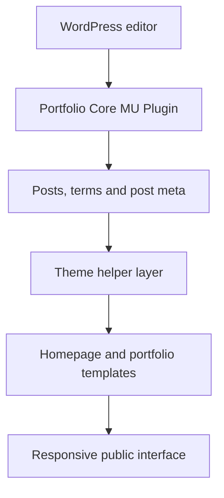

# Architecture

## Purpose

The project is organized around one central rule: durable portfolio data should not depend on the active theme.

The production implementation therefore separates the portfolio domain model into a must-use plugin and keeps public presentation in the theme. This is a pragmatic WordPress architecture rather than a framework-style abstraction.

## Component map

## MU plugin responsibilities

The core plugin owns the information that must remain available when presentation changes:

- registration of the `ya_portfolio` custom post type;
- registration of the hierarchical `portfolio_category` taxonomy;
- project details metadata and validation;
- project gallery metadata, ordering, and image layout;
- administrative media-selection behavior;
- public comment anti-spam controls.

This boundary prevents a future redesign from making project records inaccessible or forcing content migration out of theme-specific storage.

## Theme responsibilities

The theme owns visual and interaction concerns:

- modular homepage sections;
- manually selected featured projects;
- portfolio archive and taxonomy views;
- single case-study layout;
- responsive card and gallery rendering;
- profile, service, skill, recommendation, history, and contact settings;
- frontend dependency loading and page interactions.

## Request-to-render flow

1. WordPress resolves the requested homepage, archive, taxonomy, or single-project route.
2. The MU plugin supplies the registered content type, taxonomy, and saved metadata.
3. Focused helper classes normalize dates, categories, project facts, thumbnails, and gallery entries.
4. A template renders escaped HTML with lazy images and accessible link labels.
5. JavaScript progressively enhances filtering, sliders, lightboxes, page transitions, and animations.

The primary content remains readable without depending on animation completion.

## Data model

### Portfolio post

The post itself stores the narrative content:

- title;
- excerpt;
- long-form case study;
- featured image;
- revisions;
- menu order;
- comments.

### Taxonomy

`portfolio_category` classifies work by project or service type and supports:

- hierarchical terms;
- REST API exposure;
- admin columns;
- public archive routes.

### Project metadata

The details module handles:

| Field | Storage behavior |
|---|---|
| Project URL | URL sanitization |
| Order date | Date validation and formatting |
| Final date | Date validation and formatting |
| Status | Fixed allowlist |
| Client | Plain-text sanitization |
| Location | Plain-text sanitization |
| Location URL | URL sanitization |

Empty values delete their metadata instead of leaving stale empty records.

### Gallery metadata

The gallery stores a sanitized ordered list of attachment IDs plus the intended presentation layout for each item. The frontend can use the explicit choice or infer a fallback from image dimensions.

## Security boundaries

Administrative writes require:

- a valid nonce;
- an authenticated user with edit permission;
- a non-autosave request;
- field-specific validation and sanitization.

Public comment checks combine independent low-friction signals:

- form nonce;
- invisible honeypot;
- signed timestamp;
- minimum and maximum completion time;
- per-user or per-IP rate limiting;
- maximum link count.

No single signal is treated as complete spam protection.

## Performance decisions

- `WP_Query` instances that do not need pagination use `no_found_rows`.
- Featured and card images use `loading="lazy"` and `decoding="async"`.
- Thumbnail fallbacks are centralized.
- Administrative gallery scripts load only on portfolio editing screens.
- Frontend dependencies are served locally.
- Project IDs are capped before the featured-project query.

## Accessibility decisions

- Sections use stable heading relationships.
- Image links receive project-specific accessible labels.
- Decorative icons are hidden from assistive technology.
- Real image alternative text is used when available, with a project-title fallback.
- Project navigation remains ordinary server-rendered links even when enhanced by transitions.

## Production boundary

The code in this repository is intentionally representative, not a synchronized copy of production. Names, structure, and logic are simplified where needed to avoid publishing the complete private implementation.
